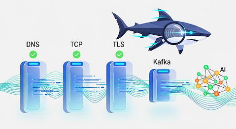

# kshark 



**A powerful command-line tool for diagnosing and troubleshooting Apache Kafka connectivity.**

`kshark` acts like a network sniffer for Kafka, providing a comprehensive health check of your entire client-to-broker communication path. It helps developers and SREs quickly identify issues related to DNS, TCP, TLS, SASL authentication, and Kafka protocol-level interactions.

---

## Key Features

-   **Layered Connectivity Checks:** Systematically tests the stack from network (L3/L4) and security (L5/6) up to the Kafka protocol (L7).
-   **End-to-End Probes:** Optionally performs a full produce-and-consume loop to a specified topic to validate data flow.
-   **AI-Powered Analysis (Premium):** Integrates with AI providers to analyze report failures, suggest root causes, and provide actionable fixes.
-   **CI/CD Ready:**
    -   **Cross-Platform Builds:** GitHub Actions workflow automatically compiles binaries for Linux, macOS, and Windows.
    -   **Dockerized:** Comes with a multi-stage `Dockerfile` for building a minimal, secure container image for Kubernetes or other container environments.
-   **Extensible Configuration:** Uses a simple `.properties` file format, familiar to Java/Kafka developers, to configure all connection parameters.

## Getting Started

### Prerequisites

-   Go (version 1.23 or newer) installed.
-   Docker installed and running.
-   Access to a Kafka cluster.

### Installation & Usage (Local)

1.  **Clone the Repository:**
    ```bash
    git clone https://github.com/your-username/kshark.git
    cd kshark
    ```

2.  **Configure:**
    -   Copy the example configuration file: `cp client.properties.example client.properties`.
    -   Edit `client.properties` with your Kafka broker and security details.
    -   (Optional) For the AI analysis feature, copy `ai_config.json.example` to `ai_config.json` and add your API keys.

3.  **Build the Binary:**
    ```bash
    go build -o kshark ./cmd/kshark
    ```

4.  **Run a Health Check:**
    ```bash
    # Basic connectivity and metadata check
    ./kshark -props client.properties

    # Include a produce/consume test on a specific topic
    ./kshark -props client.properties -topic my-test-topic

    # Run the AI analysis on the results (requires license.key)
    ./kshark -props client.properties -topic my-test-topic --analyze
    ```

### Installation & Usage (Docker)

You can also build and run `kshark` as a Docker container.

1.  **Build the Image:**
    From the `IMPL/kshark` directory, run:
    ```bash
    docker build -t kshark:latest .
    ```

2.  **Run the Container:**
    A test script is provided to simplify running the container. It mounts the necessary configuration files from your local directory.
    -   Ensure your `client.properties`, `ai_config.json`, and `license.key` are in the `IMPL/kshark` directory.
    -   Make the test script executable: `chmod +x test_docker.sh`
    -   Run the test script: `./test_docker.sh`

    This will run the `kshark` tool inside the container and save the output reports to a new `reports/` directory on your local machine.

## Project Structure

-   `/cmd/kshark`: Main application entry point.
-   `/web/templates`: Contains the HTML template for AI analysis reports.
-   `/.github/workflows`: GitHub Actions CI/CD pipeline for automated builds.
-   `/Dockerfile`: For building the application container image.
-   `go.mod`, `go.sum`: Go module dependency files.

## License

This project is licensed under the Apache License 2.0. See the [LICENSE](LICENSE) file for details.
