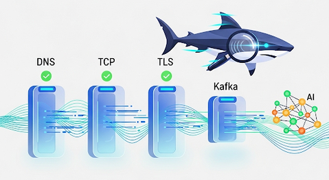

# kshark



**A powerful command-line diagnostic tool for Apache Kafka and connector target connectivity**

`kshark` acts like a network sniffer for Kafka, providing comprehensive health checks of your entire agent-to-broker communication path — and now also validates connectivity from Kafka Connect workers to their source and sink database targets (MongoDB, PostgreSQL, DB2). It systematically tests every layer from DNS resolution through TLS security to application protocol-level interactions, helping developers and SREs quickly identify and resolve connectivity issues.

[](LICENSE)
[](https://golang.org/)

---

## Built for AI Agents and Teams of Collaborating Experts

**Tools are the difference between AI assistants and AI operators.**

Without reliable, structured tools, AI agents are limited to conversation. With them, they become autonomous operators capable of real diagnostic work. `kshark` is designed from the ground up to be agent-executable:

- **Deterministic Output:** Structured JSON and HTML reports that agents can parse, analyze, and act upon
- **Layered Diagnostics:** Clear failure isolation (L3→L4→L5-6→L7) so agents know exactly where problems occur
- **Zero Human Intervention:** Fully automated execution with `-y` flag, timeout controls, and exit codes
- **Rich Context:** Every test returns actionable data — not just pass/fail, but metrics, timestamps, and error details

**Why This Matters:**

Human operators diagnose Kafka issues by running multiple commands: `nslookup`, `telnet`, `openssl s_client`, `kafka-console-producer`. They correlate failures, infer root causes, and retry with different parameters.

AI agents need to do the same work — but they need tools that package that workflow into a single, reliable interface. `kshark` is that interface for Kafka connectivity validation.

When an agent needs to validate a client configuration, diagnose a connection failure, or verify topic accessibility, `kshark` provides the structured, comprehensive output required to make informed decisions and take corrective action.

**This is the future of infrastructure operations:** agents equipped with purpose-built diagnostic tools, operating autonomously to validate, diagnose, and remediate connectivity issues before they impact production.

**Made with ❤️ for the Kafka community**

[](LICENSE)
[](https://golang.org/)

---

## Table of Contents

- [Key Features](#key-features)
- [Quick Start](#quick-start)
- [Installation](#installation)
- [Usage](#usage)
- [Connector Probe](#connector-probe)
- [Neighborhood Scan & Restriction Detection](#neighborhood-scan--restriction-detection)
- [Diagnostics Bundle](#diagnostics-bundle)
- [Configuration](#configuration)
- [Integration Testbed](#integration-testbed)
- [Documentation](#documentation)
- [Architecture](#architecture)
- [Contributing](#contributing)
- [License](#license)

---

## Key Features

### Comprehensive Connectivity Testing

-   **Layered Diagnostics:** Systematically tests all layers of connectivity:
    -   **L3 (Network):** DNS resolution and latency
    -   **L4 (Transport):** TCP connection establishment
    -   **L5-6 (Security):** TLS handshake, certificate validation, and expiry monitoring
    -   **L7 (Application):** Kafka protocol, metadata retrieval, topic visibility
    -   **L7 (HTTP):** Schema Registry and REST Proxy connectivity
    -   **L7 (Connector Targets):** MongoDB, PostgreSQL, DB2 connectivity via Kafka Connect config
    -   **Diagnostics:** Traceroute, MTU discovery, PMTU black hole detection
    -   **Neighborhood Scan:** Port-level and protocol-level restriction detection

-   **End-to-End Testing:** Full produce-and-consume loop validation to verify complete data flow

-   **Network Restriction Detection:** When TCP fails, automatically scans nearby ports (80, 443, 9092-9094) and compares ICMP vs TCP reachability to classify firewall/NSG restrictions

-   **Diagnostics Bundle:** Package reports, logs, redacted Terraform state, and system context into a portable `.tar.gz` with ready-to-use export commands (scp, docker cp, kubectl cp)

-   **Multiple Authentication Methods:**
    -   SASL/PLAIN
    -   SASL/SCRAM-SHA-256
    -   SASL/SCRAM-SHA-512
    -   Mutual TLS (mTLS)
    -   SASL/GSSAPI (Kerberos) - with build tag

### AI-Powered Analysis (Premium)

-   **Intelligent Root Cause Detection:** Identifies which layer is causing issues
-   **Actionable Recommendations:** Provides specific fix suggestions
-   **Multiple AI Providers:** Supports OpenAI, Scalytics-Connect, and custom endpoints
-   **Automatic Problem Prioritization:** Focuses on critical failures first

### Developer-Friendly

-   **Familiar Configuration:** Java properties file format (works with existing Kafka configs)
-   **Rich Output Formats:**
    -   Color-coded console output
    -   Detailed HTML reports with visual summaries
    -   Machine-readable JSON export (Premium)
-   **Quick Presets:** Pre-configured templates for common Kafka distributions
    -   Confluent Cloud
    -   Bitnami
    -   AWS MSK
    -   Plaintext (development)

### Production-Ready

-   **Cross-Platform:** Linux, macOS, Windows (amd64, arm64)
-   **Docker Support:** Minimal Alpine-based container (~50MB)
-   **Kubernetes-Ready:** CronJob examples for continuous monitoring
-   **CI/CD Integration:** Automated releases via GitHub Actions + GoReleaser
-   **Security-Focused:**
    -   Credential redaction in reports
    -   Terraform state redaction (passwords, API keys, secrets, Confluent Cloud keys)
    -   Command injection prevention
    -   TLS 1.2+ enforcement
    -   Thread-safe concurrent diagnostics
    -   Non-root container execution

---

## Quick Start

### A) Kafka Broker Check

```bash
# 1. Create a configuration file
cat > client.properties <<EOF
bootstrap.servers=your-broker.example.com:9092
security.protocol=SASL_SSL
sasl.mechanism=PLAIN
sasl.username=your-api-key
sasl.password=your-api-secret
EOF

# 2. Run the diagnostic
./kshark -props client.properties

# 3. Test with a specific topic (includes produce/consume)
./kshark -props client.properties -topic test-topic
```

### B) Connector Target Probe via Connect API

```bash
# Probe a MongoDB connector's target — reads config from Kafka Connect REST API
./kshark -y --connect-url https://connect.example.com:8083 \
            --connector-name my-mongo-sink
```

kshark fetches the connector config, extracts the `connection.uri`, and probes MongoDB layer by layer (DNS -> TCP -> TLS -> Auth -> Ping -> Collection).

### C) Connector Target Probe via Local Config File

```bash
# Probe a PostgreSQL target using a local connector config JSON file
cat > postgres-source.json <<EOF
{
  "name": "pg-source",
  "connector.class": "io.confluent.connect.jdbc.JdbcSourceConnector",
  "connection.url": "jdbc:postgresql://pghost:5432/mydb?sslmode=require",
  "connection.user": "pguser",
  "connection.password": "pgpass"
}
EOF

./kshark -y --connector-config postgres-source.json
```

### D) Full Path: Kafka Broker + Connector Target

```bash
# Check both Kafka broker connectivity AND connector target in one run
./kshark -y -props client.properties \
            --connect-url https://connect:8083 \
            --connector-name my-mongo-sink \
            -topic test-topic
```

### Quick Preset Example

```bash
# Use a preset for Confluent Cloud
./kshark --preset cc-plain -props client.properties
```

---

## Installation

### Option 1: Download Pre-built Binary (Recommended)

Download the latest release for your platform from the [Releases page](https://github.com/scalytics/kshark-core/releases):

```bash
# Linux (amd64)
wget https://github.com/scalytics/kshark-core/releases/latest/download/kshark-linux-amd64.tar.gz
tar -xzf kshark-linux-amd64.tar.gz

# macOS (arm64 - Apple Silicon)
wget https://github.com/scalytics/kshark-core/releases/latest/download/kshark-darwin-arm64.tar.gz
tar -xzf kshark-darwin-arm64.tar.gz

# Windows (amd64)
wget https://github.com/scalytics/kshark-core/releases/latest/download/kshark-windows-amd64.zip
unzip kshark-windows-amd64.zip
```

Verify the checksum:
```bash
sha256sum -c checksums.txt
```

### Option 2: Build from Source

**Prerequisites:** Go 1.23 or newer

```bash
# Clone the repository
git clone https://github.com/scalytics/kshark-core.git
cd kshark-core

# Build
go build -o kshark ./cmd/kshark

# Verify
./kshark --version
```

### Option 3: Docker

```bash
# Pull the image (when published)
docker pull ghcr.io/scalytics/kshark-core:latest

# Or build locally
docker build -t kshark:latest .

# Run with mounted configuration
docker run -v $(pwd):/config kshark:latest -props /config/client.properties
```

---

## Usage

### Basic Commands

```bash
# Basic connectivity check
./kshark -props client.properties

# Check with topic validation
./kshark -props client.properties -topic my-topic

# Include produce/consume test
./kshark -props client.properties -topic my-topic

# Skip confirmation prompt (for automation)
./kshark -props client.properties -y

# Adjust global timeout
./kshark -props client.properties -timeout 120s

# Adjust Kafka metadata timeout
./kshark -props client.properties -kafka-timeout 20s

# Adjust produce/consume timeout
./kshark -props client.properties -op-timeout 30s

# Adjust produce/consume timeouts independently
./kshark -props client.properties -produce-timeout 20s -consume-timeout 45s

# Control probe read start offset
./kshark -props client.properties -start-offset latest

# Select partition balancer for probes
./kshark -props client.properties -topic my-topic -balancer rr

# Run all layers regardless of failures (full diagnostic mode)
./kshark -props client.properties -topic orders -probe-direction=full

# Force neighborhood port scan (even on success)
./kshark -props client.properties -topic orders -neighborhood

# Create diagnostics bundle with Terraform state
./kshark -props client.properties -topic orders \
    -bundle -tf-state=terraform.tfstate

# Generate HTML report
./kshark -props client.properties -topic my-topic
# Report saved to: reports/analysis_report_<hostname>_<timestamp>.html
```

### Premium Features (Requires license.key)

```bash
# AI-powered analysis
./kshark -props client.properties -topic my-topic --analyze

# Export to JSON
./kshark -props client.properties -json report.json
```

### Using Presets

```bash
# Confluent Cloud
./kshark --preset cc-plain -props client.properties

# AWS MSK with IAM
./kshark --preset self-scram -props client.properties

# Local development (no security)
./kshark --preset plaintext -props client.properties
```

### Command-Line Flags

| Flag | Description | Default | Example |
|------|-------------|---------|---------|
| `-props` | Path to properties file | (optional*) | `-props config.properties` |
| `-topic` | Comma-separated topics to test | (optional) | `-topic orders,payments` |
| `-group` | Consumer group for probe | (ephemeral) | `-group kshark-probe` |
| `--preset` | Configuration preset | (none) | `--preset cc-plain` |
| `-timeout` | Global timeout for entire scan | 60s | `-timeout 120s` |
| `-kafka-timeout` | Kafka metadata/dial timeout | 10s | `-kafka-timeout 20s` |
| `-op-timeout` | Produce/consume timeout | 10s | `-op-timeout 30s` |
| `-produce-timeout` | Produce timeout (overrides `-op-timeout`) | (none) | `-produce-timeout 20s` |
| `-consume-timeout` | Consume timeout (overrides `-op-timeout`) | (none) | `-consume-timeout 45s` |
| `-start-offset` | Probe read start offset (`earliest|latest`) | `earliest` | `-start-offset latest` |
| `-balancer` | Probe partition balancer (`least|rr|random`) | `least` | `-balancer rr` |
| `-diag` | Enable traceroute/MTU diagnostics | true | `-diag=false` |
| `-probe-direction` | Probe direction: `up` (fail-fast) or `full` (all layers) | `up` | `-probe-direction=full` |
| `-neighborhood` | Force port neighborhood scan (auto on TCP failure) | false | `-neighborhood` |
| `-neighborhood-ports` | Custom ports for neighborhood scan | `80,443,9092,...` | `-neighborhood-ports=443,9092,5432` |
| `-bundle` | Create diagnostics bundle (.tar.gz) | (none) | `-bundle` or `-bundle=out.tar.gz` |
| `-tf-state` | Terraform state file for bundle (redacted) | (none) | `-tf-state=terraform.tfstate` |
| `-tf-plan` | Terraform plan output for bundle (redacted) | (none) | `-tf-plan=plan.txt` |
| `-log` | Write detailed scan log to file | auto | `-log /tmp/kshark.log` |
| `--analyze` | Enable AI analysis | false | `--analyze` |
| `-no-ai` | Skip AI analysis even if enabled | false | `-no-ai` |
| `-provider` | AI provider name from `ai_config.json` | (default) | `-provider openai` |
| `-json` | Export to JSON file | (none) | `-json output.json` |
| `-y` | Skip confirmation prompt | false | `-y` |
| `--version` | Show version info | - | `--version` |
| `--connect-url` | Kafka Connect REST API URL | (none) | `--connect-url https://connect:8083` |
| `--connector-name` | Connector name to probe via Connect API | (none) | `--connector-name my-sink` |
| `--connector-config` | Local connector config JSON file | (none) | `--connector-config mongo.json` |
| `--connect-basic-auth` | user:pass for Connect API (or `KSHARK_CONNECT_AUTH` env) | (none) | `--connect-basic-auth admin:secret` |
| `--connect-bearer-token` | Bearer token for Connect API (or `KSHARK_CONNECT_TOKEN` env) | (none) | |
| `--connect-ca-cert` | CA cert PEM for Connect API TLS | (none) | |

*`-props` is optional when using connector-only mode (`--connect-url` or `--connector-config`).

---

## Connector Probe

kshark can probe the database targets that Kafka Connect connectors read from or write to. It reads the connector configuration (either from the Connect REST API or a local JSON file), extracts the connection parameters, and tests connectivity layer by layer.

### Supported Connectors

| Connector Type | Database | Protocol |
|----------------|----------|----------|
| MongoDB Sink/Source (`MongoSinkConnector`, `MongoSourceConnector`) | MongoDB / Atlas | MongoDB Wire Protocol |
| JDBC Source/Sink with `jdbc:postgresql://` URL | PostgreSQL | PostgreSQL Wire Protocol v3 |
| JDBC Source/Sink with `jdbc:db2://` URL | IBM DB2 | DRDA Wire Protocol |
| JDBC Source/Sink with `jdbc:mysql://` URL | MySQL | MySQL Wire Protocol |
| JDBC Source/Sink with `jdbc:sqlserver://` URL | SQL Server | TDS Wire Protocol |
| JDBC Source/Sink with `jdbc:oracle://` URL | Oracle | Oracle Net Protocol |
| Redis Sink/Source (`RedisSinkConnector`) | Redis | RESP Protocol |
| Elasticsearch Sink (`ElasticsearchSinkConnector`) | Elasticsearch | HTTP REST |

### Probe Layers

Each database target is probed through these layers:

```
L3-DNS       Resolve hostname
L4-TCP       TCP connection to host:port
L5-6-TLS     TLS handshake (if configured)
L7-Auth      Database authentication (SCRAM, MD5, DRDA SECCHK)
L7-Ping/DB   Database accessibility check
L7-Collection Collection/table existence (optional)
```

### Example Output

```
=== Connector Probe: my-mongo-sink ===
  Type: com.mongodb.kafka.connect.MongoSinkConnector
  Target: mongodb:27017
  Database: testdb | Collection: events

  L3-DNS       OK    Resolved to 10.0.1.1
  L4-TCP       OK    Connected in 0ms
  L5-6-TLS     SKIP  Plain connection (no TLS)
  L7-Auth      OK    Authentication succeeded
  L7-Ping      OK    Database 'testdb' responded to ping
  L7-Collection OK   Collection 'events' is accessible
```

### Config Source Options

| Mode | Flags | Use when |
|------|-------|----------|
| Connect API | `--connect-url` + `--connector-name` | Connect cluster is reachable |
| Local file | `--connector-config file.json` | Connect API is not available |
| API + fallback | All three flags | Try API first, fall back to file |

### Environment Variables

Avoid putting credentials in shell history:

```bash
export KSHARK_CONNECT_AUTH="admin:secret"    # instead of --connect-basic-auth
export KSHARK_CONNECT_TOKEN="eyJhbG..."      # instead of --connect-bearer-token
```

---

## Neighborhood Scan & Restriction Detection

When TCP connectivity to a Kafka port fails, kshark automatically probes nearby ports and protocols to classify the type of network restriction.

### How It Works

```
TCP FAIL on port 9092
  ├─ Port Scan: 80, 443, 9092, 9093, 9094, 8081, 8083
  ├─ ICMP Check: ping host
  └─ Classification: selective_port_filtering / host_unreachable / ...
```

### Example Output

```
❌  kafka          host.cloud:9092       L4-TCP   TCP connect failed: timeout
⚠️  neighborhood   host.cloud            Diag     Port scan: 80=OPEN, 443=OPEN, 9092=BLOCKED, 9093=BLOCKED | ICMP: OPEN (8ms)
    ↳ Hint: selective_port_filtering [confidence: high] Open TCP ports 9092-9094 in firewall/NSG/Security Group.
```

### Restriction Classifications

| Pattern | Classification | Confidence |
|---------|---------------|------------|
| Kafka ports blocked, 443 open | `selective_port_filtering` | high |
| All ports + ICMP blocked | `host_unreachable` | high |
| All TCP blocked, ICMP open | `all_tcp_blocked` | high |
| Connection refused (not timeout) | `service_not_listening` | high |
| All ports open | `no_network_restriction` | high |

### Usage

```bash
# Auto-triggered on TCP failure (default when -diag=true)
./kshark -props client.properties -topic orders

# Force neighborhood scan even on success (audit mode)
./kshark -props client.properties -topic orders -neighborhood

# Custom port list
./kshark -props client.properties -neighborhood -neighborhood-ports=443,9092,5432
```

---

## Diagnostics Bundle

Package all diagnostic artifacts into a portable `.tar.gz` archive for sharing with support teams.

### Bundle Contents

```
kshark-diag-<hostname>-<timestamp>/
├── report.json                      # Full kshark report
├── kshark.log                       # Run log
├── config/client.properties.redacted
├── terraform/
│   ├── terraform.tfstate.redacted   # Secrets → [REDACTED]
│   └── terraform-plan.txt           # If --tf-plan used
├── context/
│   ├── os.txt, arch.txt, hostname.txt
│   ├── resolv.conf.txt              # DNS config
│   ├── interfaces.txt               # Network interfaces
│   └── routes.txt                   # Routing table
└── MANIFEST.md                      # SHA256 checksums
```

### Usage

```bash
# Basic bundle (report + logs + configs + system context)
./kshark -props client.properties -topic orders -y -bundle

# Bundle with Terraform state (auto-redacted)
./kshark -props client.properties -topic orders -y \
    -bundle -tf-state=terraform.tfstate

# Custom output path
./kshark -props client.properties -y \
    -bundle=/tmp/diag.tar.gz -tf-state=terraform.tfstate -tf-plan=plan.txt
```

After the scan, kshark prints export commands based on your environment:

```
Diagnostics bundle created: ./kshark-diag-bastion01-20260326-140000.tar.gz

Export commands:
  # SCP to local machine:
  scp user@bastion01:/path/to/kshark-diag-bastion01-20260326-140000.tar.gz .

  # Docker copy from container:
  docker cp <container>:/path/to/kshark-diag-bastion01-20260326-140000.tar.gz .

  # Kubectl copy from pod:
  kubectl cp <namespace>/<pod>:/path/to/kshark-diag-bastion01-20260326-140000.tar.gz ./kshark-diag.tar.gz
```

### Terraform State Redaction

All sensitive values are automatically redacted:
- Passwords, secrets, API keys, tokens
- Private keys, certificates
- Connection strings (userinfo portion)
- Confluent Cloud-specific keys (`kafka_api_key`, `schema_registry_api_secret`, etc.)

---

## Configuration

### Properties File Format

kshark uses standard Java properties format, compatible with Kafka client configurations:

```properties
# Broker connection
bootstrap.servers=broker1.example.com:9092,broker2.example.com:9092

# Security protocol
security.protocol=SASL_SSL

# SASL configuration
sasl.mechanism=SCRAM-SHA-256
sasl.username=your-username
sasl.password=your-password

# TLS configuration
ssl.ca.location=/path/to/ca-cert.pem
ssl.certificate.location=/path/to/client-cert.pem
ssl.key.location=/path/to/client-key.pem

# Optional: Schema Registry
schema.registry.url=https://schema-registry.example.com
basic.auth.user.info=sr-key:sr-secret

# Optional: REST Proxy
rest.proxy.url=https://rest-proxy.example.com
```

### Supported Configuration Options

See [Configuration Guide](docs/FEATURES.md#configuration-options) for complete list.

### AI Configuration (Optional)

For AI-powered analysis, create `ai_config.json`:

```json
{
  "provider": "openai",
  "api_key": "sk-...",
  "api_endpoint": "https://api.openai.com/v1/chat/completions",
  "model": "gpt-4"
}
```

Or use environment variables:
```bash
export KSHARK_AI_PROVIDER=openai
export KSHARK_AI_API_KEY=sk-...
```

---

## Integration Testbed

A complete Docker Compose testbed is included for end-to-end testing:

```bash
cd testbed/
docker compose up -d                          # Start all services
docker compose exec kshark /run-tests.sh      # Run 10 integration tests
docker compose exec kshark /run-tests.sh --skip-db2  # Skip DB2 (Apple Silicon)
docker compose down -v                        # Cleanup
```

Services: Kafka (KRaft), Kafka Connect (MongoDB + JDBC plugins), MongoDB 7.0, PostgreSQL 16, IBM DB2 11.5.

See [testbed/TESTBED-SPEC.md](testbed/TESTBED-SPEC.md) for details.

---

## Documentation

Comprehensive documentation is available in the `docs/` directory:

| Document | Description |
|----------|-------------|
| [ARCHITECTURE.md](docs/ARCHITECTURE.md) | System architecture, components, and design patterns |
| [FEATURES.md](docs/FEATURES.md) | Complete feature list and usage examples |
| [DEPLOYMENT.md](docs/DEPLOYMENT.md) | Deployment guides for Docker, Kubernetes, and CI/CD |
| [SECURITY.md](docs/SECURITY.md) | Security audit, OWASP analysis, and recommendations |

### Quick Links

- **Architecture Overview:** [docs/ARCHITECTURE.md](docs/ARCHITECTURE.md)
- **Feature Documentation:** [docs/FEATURES.md](docs/FEATURES.md)
- **Deployment Guide:** [docs/DEPLOYMENT.md](docs/DEPLOYMENT.md)
- **Security Best Practices:** [docs/SECURITY.md](docs/SECURITY.md)
- **API Documentation:** [GoDoc](https://pkg.go.dev/github.com/scalytics/kshark-core)

---

## Architecture

kshark uses a layered testing approach to systematically validate connectivity:

```
┌─────────────────────────────────────────┐
│  L3: Network Layer                      │
│  • DNS Resolution                       │
│  • Hostname to IP mapping               │
└─────────────────────────────────────────┘
                  ↓
┌─────────────────────────────────────────┐
│  L4: Transport Layer                    │
│  • TCP Connection                       │
│  • Latency Measurement                  │
└─────────────────────────────────────────┘
                  ↓
┌─────────────────────────────────────────┐
│  L5-6: Security Layer                   │
│  • TLS Handshake                        │
│  • Certificate Validation               │
│  • Expiry Monitoring                    │
└─────────────────────────────────────────┘
                  ↓
┌─────────────────────────────────────────┐
│  L7: Application Layer                  │
│  • Kafka Protocol                       │
│  • SASL Authentication                  │
│  • Metadata Retrieval                   │
│  • Produce/Consume Test                 │
└─────────────────────────────────────────┘
                  ↓
┌─────────────────────────────────────────┐
│  L7: Connector Targets (optional)       │
│  • MongoDB (SRV, SCRAM, Ping, Coll)     │
│  • PostgreSQL (Wire Protocol v3)        │
│  • DB2 (DRDA Wire Protocol)             │
└─────────────────────────────────────────┘
                  ↓
┌─────────────────────────────────────────┐
│  Diagnostics                            │
│  • Traceroute / Path Analysis           │
│  • MTU Discovery + PMTU Correlation     │
│  • Neighborhood Scan (on TCP failure)   │
│  • Restriction Classification           │
└─────────────────────────────────────────┘
                  ↓
┌─────────────────────────────────────────┐
│  Diagnostics Bundle (optional)          │
│  • Redacted Terraform State             │
│  • System Context (DNS, routes, IPs)    │
│  • Export: scp / docker cp / kubectl cp │
└─────────────────────────────────────────┘
```

For detailed architecture information, see [ARCHITECTURE.md](docs/ARCHITECTURE.md).

---

## Project Structure

```
kshark-core/
├── cmd/kshark/            # Main application (15 focused source files)
│   ├── main.go            # Entry point, CLI flags, watch mode
│   ├── scan.go            # Scan orchestration, config, REST proxy
│   ├── ai.go              # AI analysis prompt building + API client
│   ├── auth.go            # SASL authentication (PLAIN, SCRAM, JAAS)
│   ├── bundle.go          # Diagnostics bundle, Terraform redaction
│   ├── connector.go       # Connector probe orchestration
│   ├── diagnostics.go     # Traceroute, MTU, PMTU correlation
│   ├── httpcheck.go       # Schema Registry, REST Proxy checks
│   ├── kafka.go           # Kafka dialer, metadata, produce/consume
│   ├── neighborhood.go    # Port neighborhood scan, restriction classification
│   ├── properties.go      # Properties file loading, presets
│   ├── report.go          # Report model, JSON/HTML output
│   ├── ssrf.go            # SSRF two-tier protection
│   ├── tls.go             # TLS config, certificate validation
│   └── util.go            # Shared helpers, logging, redaction
├── internal/              # Internal packages
│   ├── probe/             # Database probing engine
│   │   ├── types.go       # ProbeTarget, ProbeStep, Prober interface
│   │   ├── common.go      # Shared DNS/TCP/TLS probe helpers
│   │   ├── mongodb.go     # MongoDB prober (mongo-driver)
│   │   ├── postgres.go    # PostgreSQL prober (pgx)
│   │   └── db2.go         # DB2 prober (custom DRDA wire protocol)
│   └── connectapi/        # Kafka Connect integration
│       ├── client.go      # Connect REST API client (SSRF-protected)
│       ├── config_parser.go # Connector type detection + config extraction
│       ├── jdbc_url.go    # JDBC URL parser (DB2, PostgreSQL)
│       └── redact.go      # Credential redaction
├── testbed/               # Docker integration testbed
│   ├── docker-compose.yml # Kafka + Connect + MongoDB + PG + DB2
│   ├── configs/           # Connector config examples
│   ├── init/              # Database initialization scripts
│   └── run-tests.sh       # 10 automated integration tests
├── web/templates/         # HTML report templates
├── docs/                  # Documentation
├── Dockerfile             # Container build definition
├── go.mod                 # Go module (kafka-go, mongo-driver, pgx)
├── LICENSE                # Apache 2.0 license
└── README.md              # This file
```

---

## Examples

### Example Output

**Console Output:**
```
╔═══════════════════════════════════════════════════════════════╗
║                    kshark Diagnostic Report                    ║
║                   Target: broker.example.com                   ║
╚═══════════════════════════════════════════════════════════════╝

[L3: Network Layer]
✓ DNS Resolution: broker.example.com → 192.0.2.1 (45ms)

[L4: Transport Layer]
✓ TCP Connection: 192.0.2.1:9092 established (123ms)

[L5-6: Security Layer]
✓ TLS Handshake: TLS 1.3 successful (234ms)
✓ Certificate: CN=broker.example.com, expires in 87 days
⚠ Certificate Expiry: Certificate expires in <90 days

[L7: Application Layer]
✓ Kafka Metadata: 3 brokers, 42 partitions
✓ Topic Visibility: 'orders' found with 6 partitions
✓ Produce/Consume: Message round-trip successful (456ms)

[Diagnostics]
✓ Network Path: 8 hops, avg latency 45ms
✓ MTU: 1500 bytes (standard Ethernet)

Summary: 9 OK, 1 WARN, 0 FAIL
```

### Docker Example

```bash
# Build image
docker build -t kshark:latest .

# Run diagnostic
docker run --rm \
  -v $(pwd)/client.properties:/config/client.properties:ro \
  -v $(pwd)/reports:/reports \
  kshark:latest -props /config/client.properties -topic test -y

# Check the report
open reports/analysis_report_*.html
```

### Kubernetes CronJob Example

```yaml
apiVersion: batch/v1
kind: CronJob
metadata:
  name: kafka-health-check
spec:
  schedule: "*/15 * * * *"  # Every 15 minutes
  jobTemplate:
    spec:
      template:
        spec:
          containers:
          - name: kshark
            image: kshark:latest
            args: ["-props", "/config/client.properties", "-topic", "health-check", "-y"]
            volumeMounts:
            - name: config
              mountPath: /config
              readOnly: true
          volumes:
          - name: config
            secret:
              secretName: kafka-credentials
          restartPolicy: OnFailure
```

---

## Troubleshooting

### Common Issues

**Problem:** DNS resolution fails
```
Solution: Check DNS server configuration, verify hostname is correct
Check: nslookup your-broker.example.com
```

**Problem:** TLS handshake fails
```
Solution: Verify TLS version support, check certificate chain
Check: openssl s_client -connect broker.example.com:9092 -showcerts
```

**Problem:** SASL authentication fails
```
Solution: Verify credentials, check SASL mechanism matches broker config
Common issues: Wrong mechanism (PLAIN vs SCRAM), incorrect credentials
```

**Problem:** "license.key required" error
```
Solution: AI analysis and JSON export are premium features
Option 1: Obtain a license.key file
Option 2: Use standard console/HTML output (free)
```

### Debug Mode

For verbose output, check the generated HTML report which includes:
- Full configuration (credentials redacted)
- Detailed error messages
- Network diagnostic output
- Timestamp and version information

---

## Contributing

We welcome contributions! Please see our contributing guidelines:

1. Fork the repository
2. Create a feature branch (`git checkout -b feature/amazing-feature`)
3. Commit your changes (`git commit -m 'Add amazing feature'`)
4. Push to the branch (`git push origin feature/amazing-feature`)
5. Open a Pull Request

### Development Setup

```bash
# Clone your fork
git clone https://github.com/scalytics/kshark-core.git
cd kshark-core

# Install dependencies
go mod download

# Run tests (if available)
go test ./...

# Build
go build -o kshark ./cmd/kshark

# Test locally
./kshark -props client.properties.example
```

---

## Security

For security concerns and vulnerability reports, please see [SECURITY.md](docs/SECURITY.md).

**Security Features:**
- Credential redaction in all outputs (including `sasl.jaas.config`)
- SSRF protection: two-tier model (DENY loopback/link-local, WARN RFC1918 for PrivateLink)
- Redirect-based SSRF bypass prevention (`CheckRedirect` handler)
- Credential scrubbing in connector probe error messages
- Connect API auth via environment variables (`KSHARK_CONNECT_AUTH`, `KSHARK_CONNECT_TOKEN`)
- Command injection prevention
- TLS 1.2+ enforcement
- Non-root container execution

**Security Notes:**
- Credentials stored in plain text configuration files (use file permissions 0600)
- RFC1918 addresses are allowed (with warning) since PrivateLink targets are common
- See [SECURITY.md](docs/SECURITY.md) for detailed analysis

---

## Code Quality

| Metric | Value |
|--------|-------|
| Statement coverage (`cmd/kshark`) | 61.6% |
| Statement coverage (`internal/connectapi`) | 75.7% |
| Statement coverage (`internal/probe`) | 72.3% |
| Test functions | 261 unit + 3 fuzz |
| `go vet` warnings | 0 |
| Race conditions (`-race`) | 0 |
| Source files | 15 (cmd) + 11 (internal) |
| Largest file | 685 lines (`main.go`) |

Key quality properties:
- **SSRF protection** on all HTTP paths (29 call sites) with two-tier model (DENY loopback, WARN RFC1918)
- **Fuzz testing** on JAAS parser, properties loader, SSRF URL validator, JDBC URL parser
- **Context cancellation** propagated through all probe functions (DNS, TCP, TLS)
- **Mutex-safe** report writes (`sync.Mutex` in Report struct)
- **Credential redaction** in reports, bundles, AI prompts, and ConfigEcho

---

## Roadmap

**Completed:**
- [x] Modular architecture (14 focused source files, internal packages)
- [x] Connector target probing (MongoDB, DB2, PostgreSQL)
- [x] SSRF protection (two-tier model)
- [x] Enhanced AI analysis prompt (layered reasoning, confidence, severity)
- [x] Integration testbed (Docker Compose, 10 automated tests)
- [x] Credential redaction hardening (sasl.jaas.config, bearer tokens)
- [x] Probe direction control (`--probe-direction=up|full`)
- [x] Neighborhood scan — port-level restriction detection with classification
- [x] PMTU black hole correlation (ICMP vs TCP cross-reference)
- [x] Diagnostics bundle with Terraform state redaction
- [x] Thread-safe concurrent diagnostics (parallel traceroute/MTU)
- [x] CI/CD pipeline (GitHub Actions, GoReleaser, SBOM, cosign signing)

- [x] MySQL, SQL Server, Oracle connector probes (wire protocol, zero dependencies)
- [x] Redis, Elasticsearch connector probes
- [x] Broker discovery scan (advertised listener mismatch detection)
- [x] Layered exit codes (1=DNS, 2=TCP, 3=TLS, 4=App, 5=Diag)
- [x] `kshark doctor` (diagnostic tool availability check)
- [x] `--watch` mode (re-run scan on interval)
- [x] `kshark diff` (compare two scan results)
- [x] `kshark trend` (historical scan analysis)

---

## License

This project is licensed under the **Apache License 2.0**. See the [LICENSE](LICENSE) file for complete details.

```
Copyright 2024-2026 Scalytics GmbH and kshark Contributors

Licensed under the Apache License, Version 2.0 (the "License");
you may not use this file except in compliance with the License.
You may obtain a copy of the License at

    http://www.apache.org/licenses/LICENSE-2.0

Unless required by applicable law or agreed to in writing, software
distributed under the License is distributed on an "AS IS" BASIS,
WITHOUT WARRANTIES OR CONDITIONS OF ANY KIND, either express or implied.
See the License for the specific language governing permissions and
limitations under the License.
```

---

## Acknowledgments

- Built with [segmentio/kafka-go](https://github.com/segmentio/kafka-go)
- MongoDB probing via [mongo-driver](https://github.com/mongodb/mongo-go-driver) (pure Go)
- PostgreSQL probing via [pgx](https://github.com/jackc/pgx) (pure Go)
- DB2 probing via custom DRDA wire protocol implementation (no CGO)
- Inspired by network diagnostic tools like `tcpdump`, `wireshark`, and `netcat`
- Special thanks to the Kafka community

---

## Support

- **Documentation:** [docs/](docs/)
- **Issues:** [GitHub Issues](https://github.com/scalytics/kshark-core/issues)
- **Discussions:** [GitHub Discussions](https://github.com/scalytics/kshark-core/discussions)

---

**Made with ❤️ for the Kafka community**
